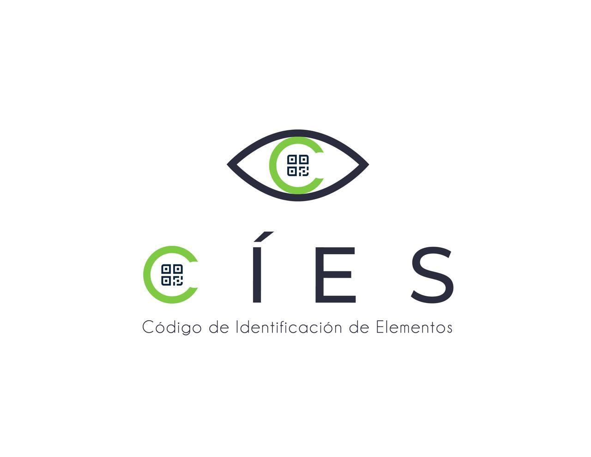

<!-- PROJECT LOGO -->
<br />
<p align="center">
  <a href="https://github.com/othneildrew/Best-README-Template">
    
  </a>

  <h3 align="center">CIES App Backend</h3>

  <p align="center">
    An awesome sistem to register the items that enter and leave your facility automatically!!
    <br />
  </p>
</p>


<!-- TABLE OF CONTENTS -->
<details open="open">
  <summary>Table of Contents</summary>
  <ol>
    <li>
      <a href="#about-the-project">About The Project</a>
      <ul>
        <li><a href="#built-with">Built With</a></li>
      </ul>
    </li>
    <li>
      <a href="#getting-started">Getting Started</a>
      <ul>
        <li><a href="#prerequisites">Prerequisites</a></li>
        <li><a href="#installation">Installation</a></li>
      </ul>
    </li>
    <li><a href="#usage">Usage</a></li>
    <li><a href="#roadmap">Roadmap</a></li>
    <li><a href="#contributing">Contributing</a></li>
    <li><a href="#license">License</a></li>
    <li><a href="#contact">Contact</a></li>
    <li><a href="#acknowledgements">Acknowledgements</a></li>
  </ol>
</details>


<!-- ABOUT THE PROJECT -->
## About The Project

CIES is an app to automatically register items that enter and leave a company facilities using QR codes and a cell phone camera. Automatically records in a database all the details of each item that enters or leaves the installation, It also allows to create automatic reports in case of item loss and allows the automatic sending of emails to inform the owner of the lost item if it is found


The project is divided into three subprojects: backend, web frontend, mobile frontend; each one in its respective repository. 
This repository is the backend code source


Features implemented in the backend:
* User management system
* User login
* User roles and permissions
* Registration of visitors and items
* Queries of user, items and visit history data
* Lost property report
* Automatic sending of emails
* Automatic generation of hashes and QR codes pages in pdf format ready to print

### Built With

* [Python:3.6](https://www.python.org/)
* [Django 1.11](https://www.djangoproject.com/)
* [Django rest framework](https://www.django-rest-framework.org/)
* [PostgreSQL](https://www.postgresql.org/)
* [NGINX](https://www.nginx.com/)
* [Docker](https://www.docker.com/)
* [Docker Compose](https://docs.docker.com/compose/install/)


<!-- GETTING STARTED -->
## Getting Started

### Prerequisites

In order to make the program work, we must have Docker and Docker Compose installed on the system and have an account at [sendgrid.com](https://sendgrid.com/)

### Installation

1. Clone the repo
   ```sh
   git clone https://github.com/d1sd41n/CIES_app_backend.git
   ```
2. Set env vars <br/>
  in .envs/.production/.postgres
   ```txt
    POSTGRES_DB=mydb
    POSTGRES_USER=example
    POSTGRES_PASSWORD=secret
    DB_HOST=db
    DB_PORT=5432
    ```
   .envs/.production/.django
   ```txt
    DJANGO_SECRET_KEY=l46a%a8c@jn^vk$bj)0@eh1au8&-ypngcv^3jf9w40!d$(7uq^
    EMAIL_USER=user
    EMAIL_PASSWORD=password
    ```
    The fields EMAIL_USER and EMAIL_PASSWORD are your username and the password of the Sendgrid api that receives orders to send emails
    
3. create an SSL certificate, rename the .crt and .key files to nginx.crt and nginx.key and add them to the sslfiles directory
4. build the project images using docker compose and then enter the web container to create a django superuser
    ```sh
    $ docker-compose -f production.yml up --build
    $ docker-compose -f dev.yml run web sh
    ```
    inside web container
    ```sh
    $ python manage.py createsuperuser
    ```
5. This app uses the user system that django brings by default, so the next step will be to enter the django administrator and create the following user groups that define the roles in the system, these are:
    ```txt
    Developer, Manager, Superviser, Guard
    ```
With these configurations the project is ready to work, now the following thing is to proceed to create a company, create and assign to it a user of type Manager; this can be done from the django admin.
Once this is done, you can use that user to log in from either of the two frontend applications from where from now on you can manage the entire system without touching the backend anymore.


### Author's notes
At the moment this is all the documentation, in case someone is interested in using this project for something or would like to contribute, you can contact me on my [twitter](https://twitter.com/1l_dan) and I will expand the documentation

In the next few days I will be uploading the web and mobile frontend 

<!-- CONTRIBUTING -->
## Contributing

Contributions are what make the open source community such an amazing place to be learn, inspire, and create. Any contributions you make are **greatly appreciated**.

1. Fork the Project
2. Create your Feature Branch (`git checkout -b feature/AmazingFeature`)
3. Commit your Changes (`git commit -m 'Add some AmazingFeature'`)
4. Push to the Branch (`git push origin_github feature/AmazingFeature`)
5. Open a Pull Request


<!-- LICENSE -->
## License

Distributed under the MIT License. See `LICENSE` for more information.


<!-- CONTACT -->
## Authors

Daniel Pérez - [Twitter](https://twitter.com/1l_dan) - [github.com/d1sd41n](https://github.com/d1sd41n) 

Luis Moreno - [github.com/luismorenolopera](https://github.com/luismorenolopera)

Daniel Gil - [github.com/Jodagito](https://github.com/Jodagito) 

